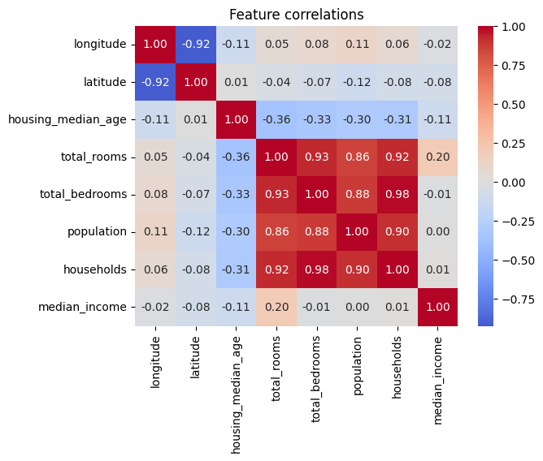
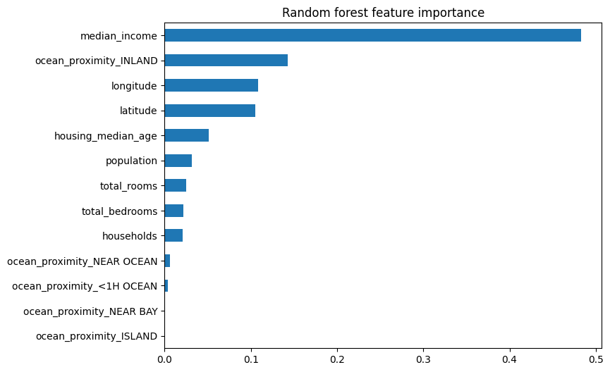

# 🏡 California House Price Prediction using Machine Learning


## 📌 Project Overview

This project predicts **California House Prices** using Machine Learning techniques. It demonstrates a complete end-to-end machine learning workflow, from data exploration and preprocessing to model training, evaluation, and model serialization.

The project uses **Scikit-learn Pipelines** and **Random Forest Regression** to build an efficient and reusable prediction system.

---

## 🎯 Project Objectives

- Predict California house prices accurately.
- Perform Exploratory Data Analysis (EDA).
- Handle missing values and categorical features.
- Build reusable preprocessing pipelines.
- Compare different regression algorithms.
- Evaluate models using RMSE.
- Save the trained pipeline and model for future predictions.

---

## 📂 Dataset

The project uses the **California Housing Dataset**, which contains demographic and housing information collected from the California census.

### Features

- Longitude
- Latitude
- Housing Median Age
- Total Rooms
- Total Bedrooms
- Population
- Households
- Median Income
- Ocean Proximity

### Target Variable

- Median House Value

---

## 🛠️ Technologies Used

- Python
- Pandas
- NumPy
- Matplotlib
- Scikit-learn
- Joblib
- Jupyter Notebook / Google Colab

---

## 📊 Exploratory Data Analysis (EDA)

The following analyses were performed:

- Dataset overview
- Missing value analysis
- Correlation analysis
- Histograms
- Scatter plots
- Income category distribution
- Geographical visualization
- Feature relationships

---

## ⚙️ Data Preprocessing

A preprocessing pipeline was built using **Scikit-learn Pipeline** and **ColumnTransformer**.

### Numerical Features

- Median Imputation
- Standard Scaling

### Categorical Features

- One-Hot Encoding

The preprocessing pipeline ensures the same transformations are applied during both training and prediction.

---

## 🤖 Machine Learning Models

The following models were trained and compared:

- Linear Regression
- Random Forest Regressor

Random Forest produced the best prediction performance.

---

## 📈 Model Evaluation

The models were evaluated using **Root Mean Squared Error (RMSE)**.

| Model | RMSE |
|-------|------|
| Linear Regression | ~69,000 |
| Random Forest | ~49,000 |
| Final Test RMSE | ~47,000 |

**✅ Best Model:** Random Forest Regressor

---

## 📂 Project Structure

```
California-House-Price-Prediction/
│
├── California_House_Price_prediction.ipynb
├── housing.csv
├── pipeline.pkl
├── requirements.txt
├── README.md
│
└── images/
    ├── correlation_heatmap.png
    ├── feature_importance.png
    ├── actual_vs_predicted.png
    └── housing_distribution.png
```

---

## 🚀 Installation

### Clone the Repository

```bash
git clone https://github.com/iamatulcs/California-House-Price-Prediction.git
```

### Navigate to the Project Folder

```bash
cd California-House-Price-Prediction
```

### Install Dependencies

```bash
pip install -r requirements.txt
```

### Run the Notebook

```bash
jupyter notebook
```

---

## 📸 Project Screenshots

> Add your screenshots inside the **images** folder.

### Correlation Heatmap

```markdown

```

### Feature Importance

```markdown

```

### Actual vs Predicted

```markdown

```

---

## 📦 Model Files

This repository includes the preprocessing pipeline used for transforming the input data.

Due to GitHub's file size limitation, the trained **model.pkl** file is **not included** in this repository.

You can regenerate the model by running the notebook from start to finish.

---

## 💡 Key Learnings

This project helped me gain practical experience in:

- Exploratory Data Analysis (EDA)
- Data Cleaning
- Feature Engineering
- Machine Learning Pipelines
- One-Hot Encoding
- Feature Scaling
- Model Selection
- Cross Validation
- Random Forest Regression
- Model Serialization using Joblib

---

## 🔮 Future Improvements

- Hyperparameter tuning using GridSearchCV
- XGBoost Regressor
- Gradient Boosting Regressor
- Streamlit Web Application
- Flask API Deployment

---

## 📋 Requirements

```text
numpy
pandas
matplotlib
seaborn
scikit-learn
joblib
```

---

## 👨‍💻 Author

**Atul Kumar Anupam**

**Data Analyst | Python | SQL | Machine Learning | Power BI**

- 🔗 **LinkedIn:** https://www.linkedin.com/in/atul-kumar-anupam/
- 💻 **GitHub:** https://github.com/iamatulcs

---

## ⭐ Support

If you found this project useful, consider giving it a **⭐ Star** on GitHub.

It motivates me to build and share more data science and machine learning projects.

---

## 📜 License

This project is licensed under the MIT License.
